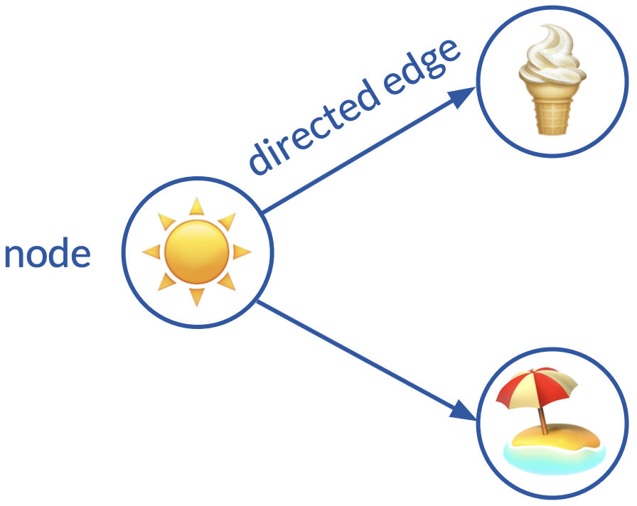

# Interactive Visual Exploration of Causal Structures for Neuropathic Pain Diagnosis

## Introduction

Revealing causal structures from observational data is an essential task in many data analysis issues across various domains, such as natural sciences, business, and healthcare. In healthcare, neuropathic pain, which is caused by a disease or lesion of the somatosensory system, is one of the most common medical problems, whose diagnosis process has well-understood causal structures. 

Causal structures are commonly visualized as a directed acyclic graph (DAG) or a node-link diagram, in which nodes represent variables, and edges represent causal relationships between data dimensions. However, these simple static graphs do not convey sufficient information for either an intuitive interpretation for novel viewers, or an in-depth exploration for experts. 

<p align="center">

</p>
<p align="center">
<em>A simple example of a node-link diagram</em>
</p>


In this project, the visualization of causal structures for neuropathic pain diagnosis is set into context. **An interactive system that integrates application-specific visualization, i.e. a discomfort drawing and a spinal cord diagram, into causality visualization is developed.** 
> A prototype of the interactive system is published [here](https://oscilloscope98.github.io/Causality-Visualization-Master-Thesis/). The system visualizes the causal structures of the neuropathic pain diagnosis process, with the help of application-specific visualization.

The system is further evaluated by a domain expert on neuropathic pain and a researcher in causal discovery through semi-structured interviews. **The results show that the system reveals the causal structures for neuropathic pain diagnosis in a more intuitive, efficient way, and conveys more focused information compared to traditional node-link diagrams. The system is also demonstrated to be helpful to the medical community in neuropathic pain diagnosis, not only for doctors but also for patients.**

> For detailed information (including background, system design, development process, etc.) of this project, please refer to the thesis, which can be downloaded [here](https://www.diva-portal.org/smash/record.jsf?dswid=3188&pid=diva2%3A1614957&c=1&searchType=SIMPLE&language=en&query=Interactive+Visual+Exploration+of+Causal+Structures+for+Neuropathic+Pain+Diagnosis&af=%5B%5D&aq=%5B%5B%5D%5D&aq2=%5B%5B%5D%5D&aqe=%5B%5D&noOfRows=50&sortOrder=author_sort_asc&sortOrder2=title_sort_asc&onlyFullText=false&sf=all).

## Local Setup
This project is developed as a web-based application. To run this project locally, in your command line, clone this repository with

```
git clone https://github.com/Oscilloscope98/Causality-Visualization-Master-Thesis.git
```

Then go to the specific folder, install the dependencies through

```
npm install
```
> If you do not have ```npm``` installed on your computer, refer to [this link](https://docs.npmjs.com/downloading-and-installing-node-js-and-npm) for installation.

After that, run

```
npm start
```
so that you could visit this system on: [localhost:3000](localhost:3000)